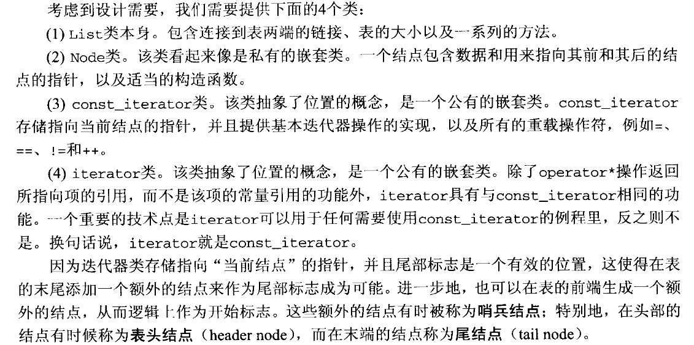

# list
这里讨论的list指是**双向链表(double linked list)**，对应C++STL中的List
## 支持操作：
* size
* clear 
* empty
* push_back
* pop_back
* back
* front
* insert
* erase
* --↑与vector共有
* push_front
* pop_front

## 实现细节：

* 在表的前端添加一个额外的节点，作为开始的标志，称为**哨兵节点**，这样可以去掉很多特例（第一个节点的删除）
* 特别的，在头部的节点有时称为**头节点（header node）**，在尾部的节点称为**尾节点（tail node）**