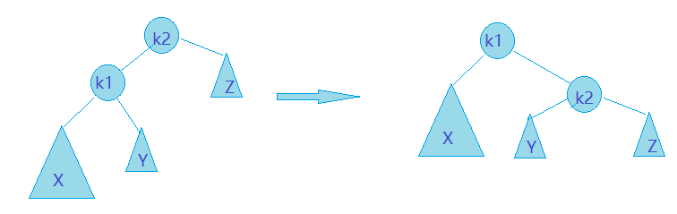
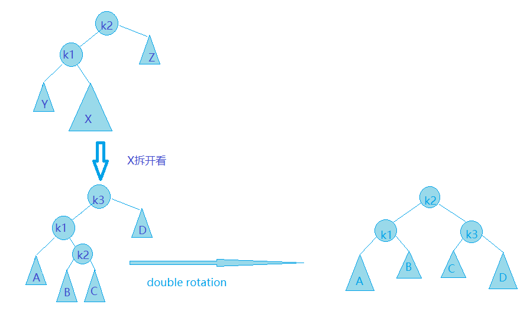

# AVL树 AVL-Tree
## 结构性质
AVL树是带有平衡条件的二叉查找树，它保持树的深度是**O(logN)**。  
**一棵AVL树的每个节点的左子树和右子树的高度最多差1。**
## 基本操作
### Insert⭐
插入一个节点可能破坏AVL树的特性。树的特性被破坏后，可以通过**旋转(rotation)**来进行修正。  
导致不平衡的四种情况：
1. 对a节点的左子节点的左子树进行一次插入
2. 对a节点的右子节点的右子树进行一次插入
3. 对a节点的左子节点的右子树进行一次插入
4. 对a节点的右子节点的左子树进行一次插入

* 前两中情况是互相对称的，发生在“外侧”，可以用一次 单旋转(single rotation)来完成调整
* 后两种情况是互相对称的，发生在“内侧”，可以用稍复杂的 双旋转(double rotation)来完成调整
* 插入后，一次旋转操作总是使整棵树的高度与原来树的高度相同，通向根节点的路径的高度不需要进一步的修正，因而总是**只需要一次旋转操作**

#### 单旋转:
  
#### 双旋转：
  
可以将Y当作是一个根k2和两颗子树B,C构成的子树。B或C中有一棵比D深两层(或者B，C，D都为空)，即使不知到是那一颗也没关系，这不影响操作。  
双旋转可以用两次单旋转来完成:
```
singleRotation(k1);
singleRotation(k3);
```

## Delete⭐
执行完普通查找二叉树的删除操作后，在根节点到删除节点的路径上，检查需要旋转的子树并对其进行旋转。
