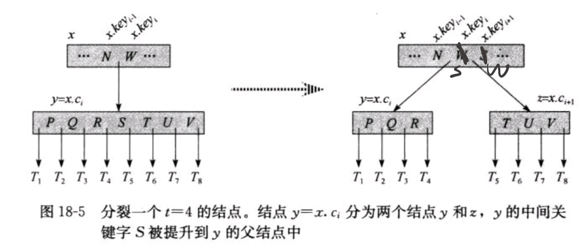

# B-Tree
## 结构性质
* 每个节点可以储存多个关键字,其数量记为x.n
* 某个节点x的x.n个关键字x.key[1], x.key[2], ... x.key[x.n] 以非降序存放(x.key[1] <= x.key[2] ...)
* 每个节点包含一个标记，指示其是 叶节点 或 内部节点
* 每个内部节点x包含x.n + 1 个指向其子节点的指针x.c[1], x.c[2], ... x.c[x.n+1]
* 内部节点的x.n个关键字对x.n+1个子节点进行分割,(记x.c[i]中的任意关键字为key[i]):
  * key[1] <= x.c[1] <= key[2] <= x.c[2] <= ...... <= x.c[x.n] <= key[x.n+1]
* 每个叶节点具有相同的深度，即树的高度h
* 每个节点所包含的关键字个数存在上界和下界，用B树的**最小度数(minmum degree)** t(**t>=2**)来限制:
  * **除根节点外**的每个节点至少有t-1个关键字(最少t个子节点)
  * 每个节点最多可以包含2t-1个关键字(内部节点最多2t个子节点)
  * (t = 2时为B树最简单的形式，每个内部节点有2、3、4个子节点, 称为2-3-4树)
## 性质
* 高度h <= log t (n+1/2)。t很大时，高度很低，以减少对磁盘的访问次数。

## 基本操作
### Find
通过与储存在节点上多个关键字比较，找到该关键字或进一步确定该关键字所在的子树。
### Insert
* 对满的节点（y.n = 2t - 1)的处理 -- **split(分裂)** --> 两个节点
  * 按其*中间关键字(median key)* y.c[t]把其 *分裂(split)* 为两个各含t-1个关键字的节点
  * 中间关键字将被提升到y的父节点x中，以作为分裂出来的两颗树的划分点

### FindMin/FindMax
### Delete

* Insert和Delete的从时间角度来说，M的最好选择是3或4，M再增大时插入和删除的时间就会增加。

### 应用：
用于对磁盘的访问，协调较慢的磁盘读取与CPU的处理速度