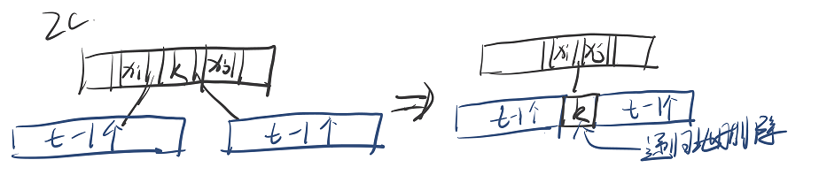
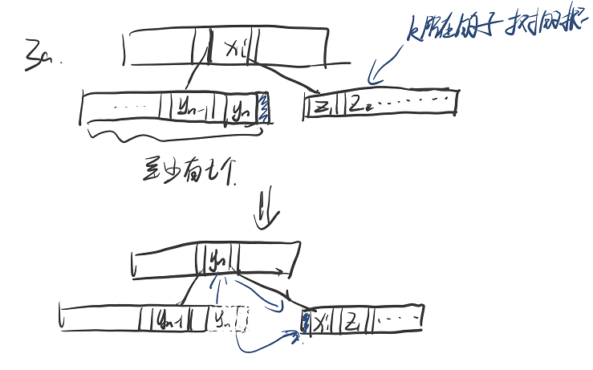
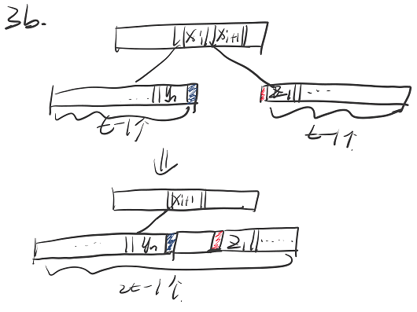
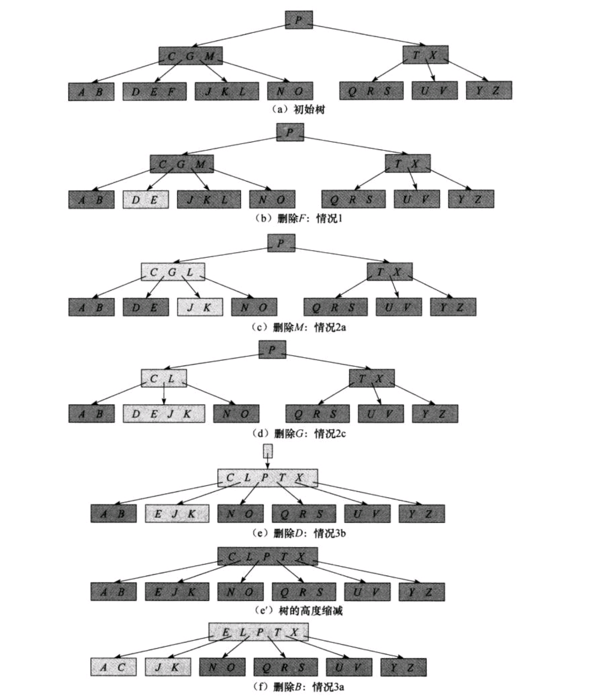

# B-Tree
## 结构性质
* 每个节点可以储存多个关键字,其数量记为x.n
* 某个节点x的x.n个关键字x.key[1], x.key[2], ... x.key[x.n] 以非降序存放(x.key[1] <= x.key[2] ...)
* 每个节点包含一个标记，指示其是 叶节点 或 内部节点
* 每个内部节点x包含x.n + 1 个指向其子节点的指针x.c[1], x.c[2], ... x.c[x.n+1]
* 内部节点的x.n个关键字对x.n+1个子节点进行分割,(记x.c[i]中的任意关键字为key[i]):
  * key[1] <= x.c[1] <= key[2] <= x.c[2] <= ...... <= x.c[x.n] <= key[x.n+1]
* 每个叶节点具有相同的深度，即树的高度h
* 每个节点所包含的关键字个数存在上界和下界，用B树的**最小度数(minmum degree)** t(**t>=2**)来限制:
  * **除根节点外**的每个节点至少有t-1个关键字(最少t个子节点)
  * 每个节点最多可以包含2t-1个关键字(内部节点最多2t个子节点)
  * (t = 2时为B树最简单的形式，每个内部节点有2、3、4个子节点, 称为2-3-4树)
## 性质
* 高度h <= log t (n+1/2)。t很大时，高度很低，以减少对磁盘的访问次数。

## 基本操作
### Find
通过与储存在节点上多个关键字比较，找到该关键字或进一步确定该关键字所在的子树。
### Insert
* 对无法再插入关键字的满的节点（y.n = 2t - 1)的处理 -- **split(分裂)** --> 两个节点
  * 按其*中间关键字(median key)* y.c[t]把其 *分裂(split)* 为两个各含t-1个关键字的节点 
  * 中间关键字将被提升到y的父节点x中，以作为分裂出来的两颗树的划分点

* 可以在沿树向下插入关键字时，分裂沿途遇到的每一个满节点，以确保可以插入关键字
### FindMin/FindMax
### Delete
递归的删除关键字k：
* 在递归调用过程中保证 当前节点x 中关键字的个数最少为t(比最小允许的数量t-1大1)
* 几种情况：
1. k在x中，x为叶节点：直接从x中删除(递归调用过程中以保证关键字最少为t)
2. k在x中，x为内部节点：
   * a. if     k之前的那个x的子节点y中的关键字数包含至少t个关键字：用y中最后一个节点k2替换k，并递归地删除k
   * 
   * b. elseif k之后的那个x的子节点z中的关键字数包含至少t个关键字：用z中第一个节点k2替换k，并递归地删除k
   * c. else   (y,z都只有t-1个关键字的情况)：将k和z并入y，（x失去k和指向y的指针），递归地删除k
   * 
3. k不在x中： 需找到包含k的子树的根y，如果y只有t-1个关键字，必须执行以下操作以确保y中至少包含t关键字↓，然后递归的删除k
   * a. if    y的一个相邻的兄弟节点至少包含t个关键字：将x中的一个关键字降至y，将y的兄弟节点的一个关键字升到x
   * 
   * b. else  (相邻的兄弟节点都只有t-1个关键字): 将该y与一个相邻的兄弟节点合并（x中 y和该兄弟节点指针之间的那个节点也并进来）
   * 
* 最后若根为空（不含关键字）则让其唯一的子节点成为新的根。
* 
* Insert和Delete的从时间角度来说，M的最好选择是3或4，M再增大时插入和删除的时间就会增加。

### 应用：
用于对磁盘的访问，协调较慢的磁盘读取与CPU的处理速度