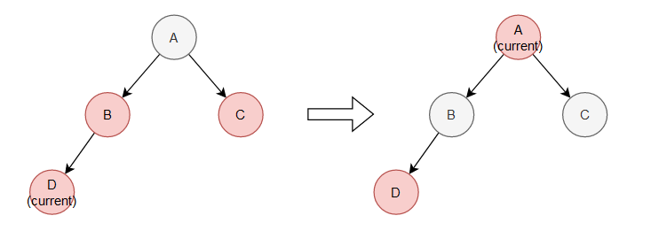
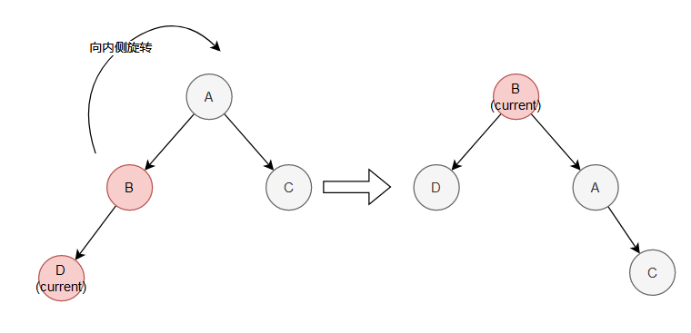
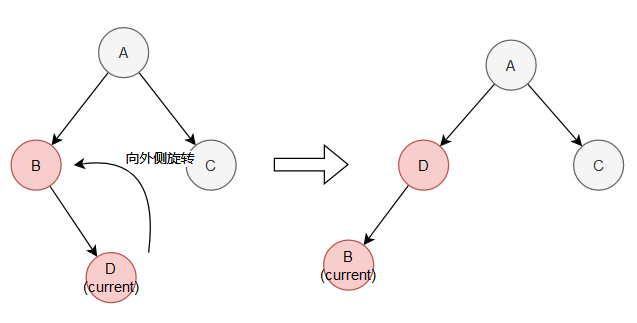

# 红黑树
## 结构性质
### 基本性质：
* 每个节点是红的、或是黑的
* 根节点是黑的
* 各个叶节点(*在此指空指针所代表的节点*)为黑色
* 不能有两个连续的红色节点（一个红色节点的两个子节点都是黑色的）
* 对每个节点，到其所有后代叶节点的简单路径上，均包含相同数目的黑色节点。

### 引理：一颗有n个内部节点的红黑树的高度至多为2log(n+1).

## 基本操作

### Insert⭐

* 使用普通二叉树的插入方法，将新的值作为**红色节点**插入。插入后可能会破坏红黑树的性质，再进行修复操作

* 可以从新插入的节点开始，进行自底向上的修复操作，将违法规则的节点不断上移：

  * 当前节点是根节点：直接改为黑色，修复完成

  * 当前节点的父节点为黑色：不再需要修复

  * **当前节点的父节点为红色，叔叔节点也是红色：将父节点 和 叔叔节点 染为黑色，祖父节点染为红色，继续以祖父节点为中心继续进行修复**

    

  * **当前节点的父节点是红色，叔叔节点是黑色，当前节点在外侧：以父节点为中心向内侧进行单旋转，然会将该节点染为黑色。继续以其父节点为中心继续进行修复。**

    

  * **当前节点的父节点是红色，叔叔节点是黑色，当前节点在内测：以该节点为中心向外侧进行单旋转，则转换为了上一种情况**

    

